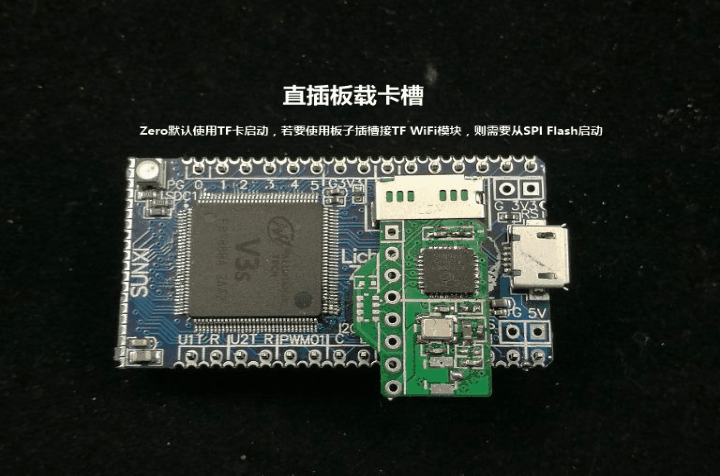
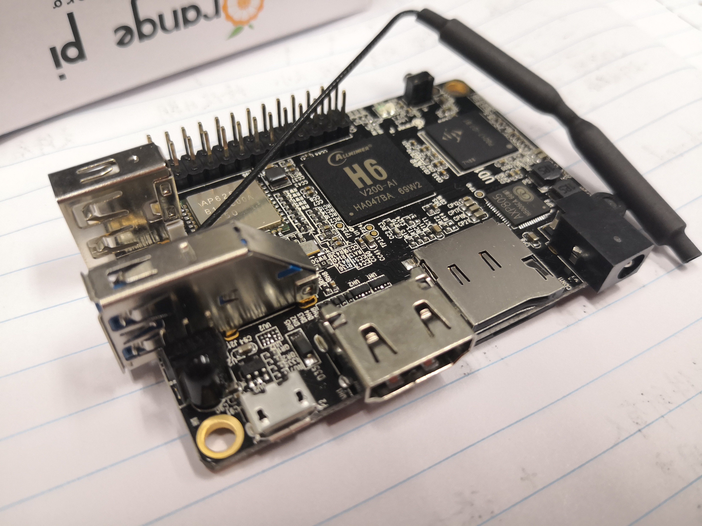
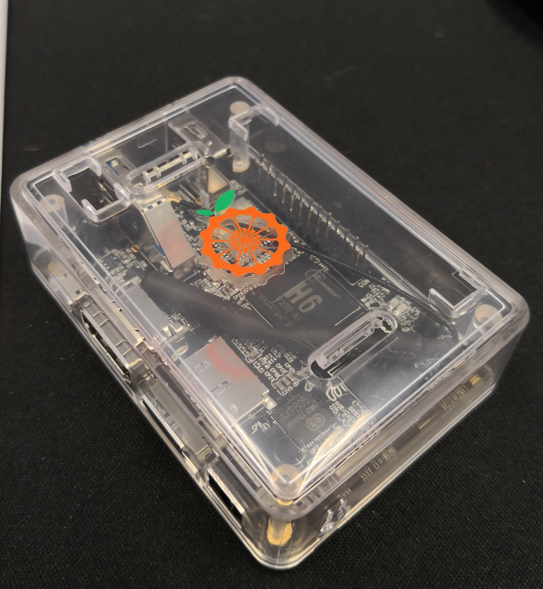
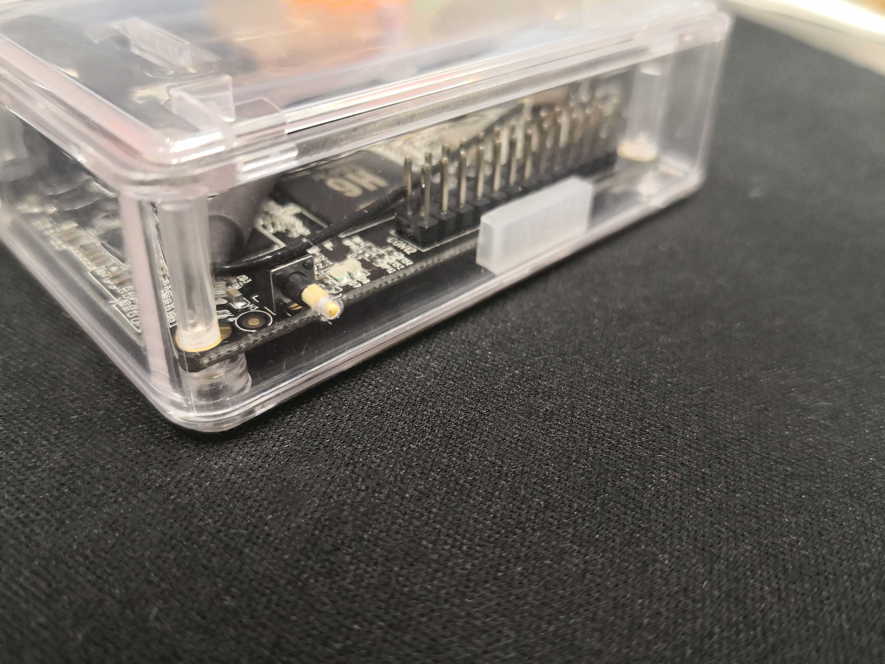

#### ARM Linux 学习笔记
**2019-10-26**

几个月前，领导批准了一笔钱给我买玩具，我打算把这笔钱花在种草已久的 arm 开发板上。买哪家产品，买哪个型号我犹豫了很久，经过一段时间的研究后，最终把目标锁定在 Raspberry Pi 和 Orange Pi 之间。

\* 目前树莓派已经出到 Raspberry Pi 4 系列了，半年前选购的时候才 3 系列，所以选购笔记里面出现的树莓派并不是最新版本。

1. 为什么是这两家？

    Raspberry Pi 和 Orange Pi 是 ARM 开发板比较知名的厂商，硬件做工相对比较好，文档翔实。国外小品牌的派我不考虑，从购买渠道到客服，跨国都极不方便。

    设计紧凑，外设丰富，适合初学者入门学习。在众多“派”里有一个叫荔枝派的品牌，也比较吸引人。荔枝派的设计理念是低耦合，它把友商一个完整的派拆分成核心部分和若干个功能单一的模块，使用的时候再按需加载组装起来。这个设计看起来非常灵活，可玩度很高，但是不太适合初学者，对于从来没有玩过 ARM 的人来说，门槛有点儿高。另外使用荔枝派的模块可能需要焊接（我发现淘宝卖的核心板只有过孔，没有针脚，可能是需要自己焊接的），手上没有工具的同学还得额外购置一套焊接设备。下面是网上找的一张 lichee zero 图，可以看到，组装出一部可玩的荔枝派还是比较费劲的：

    

2. Raspberry Pi vs. Orange Pi

    我的需求是，板子体积要小一些，基本的外设（诸如 WLAN、USB、声音等）要有，但不需要水晶头网口，型号新一些。综上，符合要求的板子，我选取了 Raspberry Pi 3 Model A+ 和 Orange Pi Lite 2，主要对比的是硬件参数和价格。

    | 参数 | Raspberry Pi 3 Model A+ | Orange Pi Lite 2 |
    | :---: | :---: | :-----: |
    | CPU | Broadcom BCM2837B0, Cortex-A53 (ARMv8) 64-bit SoC @ 1.4GHz | H6 Quad-core 64-bit ARM Cortex™-A53 @ 1.8GHz |
    | RAM | 512MB LPDDR2 SDRAM | :grinning: 1GB LPDDR3 (shared with GPU) |
    | WLAN | 2.4GHz and 5GHz IEEE 802.11.b/g/n/ac | AP6255, IEEE 802.11 ac/bb/g/n |
    | BT | :grinning: Bluetooth 4.2/BLE | BT 4.1 |
    | Video outputs | Full-size HDMI | HDMI 2.0a TX with HDCP 2.2 output |
    | Video decoding | H.264, MPEG-4 decode (1080p30)   H.264 encode (1080p30)   OpenGL ES 1.1, 2.0 graphics | :grinning: H265/HEVC 4K@60fps, upto 6Kx4K@30fps   H264/AVC 4K@30fps   VP9 4K@30fps   AVS+/AVS 1080P@60fps |
    | USB | USB 2.0 * 1 | :grinning: USB 2.0 * 1   Micro USB 2.0 otg * 1   USB 3.0 * 1 |
    | GPIO | :grinning: Extended 40-pin GPIO header | 26 Pins Header |
    | OS | :grinning: NOOBS | Debian, Ubuntu, Andriod, etc |
    | Power | 5V/2.5A DC | 5V/2.5A DC |
    | PMU | none | :grinning: AXP805 |
    | size | 65mm x 56mm | 69mm × 48mm |
    | weight | unknown | 50g |
    | price | $25 / ≈￥195 | $25 / ￥159 |

    :grinning: 表示此项明显更佳。

    两者价格一致，可能由于汇率等因素，Raspberry Pi  3 Model A+ 到手价会更高一些。明显可以看出来，在硬件上，Orange Pi Lite 2 明显会高配一些，最吸引人的就是更大的内存和电源管理，这也是促使我最终选择 Orange Pi 的关键因素。

    硬件很香，但 Orange Pi 远比不上 Raspberry Pi 的一点在于，Raspberry Pi 拥有完善的软件生态、服务和社区。

    NOOBS 比 Orange Pi 官方提供的系统镜像好太多太多，而且 Orange Pi 的官方镜像鲜有更新，至今 Ubuntu 还停留在 16.04 这个版本，加上官方对 img 镜像 /boot 分区的设置不合理，导致用户无法直接通过 Ubuntu 自带的系统升级工具进行升级，所以 Orange Pi Lite 2 至今仍不能使用到最新版本的操作系统（当前最新的 LTS 版本是 18.04 ）。

    Raspberry Pi 建立了活跃的用户社区，编写了翔实的文档，非官方的社区同样也是热闹非凡，拥有海量的官方外设和第三方外设。相比之下，Orange Pi 就寒碜很多，不仅官方的 Wiki 很少更新，官方维护的社区也是冷冷清清，只有在搜索引擎里能搜索到一两篇玩家使用经验的博客。不过还好有 Armbian 在为 Orange Pi 提供更好的第三方 ROM ，支持 Debian 和 Ubuntu 镜像，不仅系统版本更新快，紧跟潮流，而且社区讨论更加热烈。不过 Armbian 毕竟还是由第三方团队支持，ROM 适配进度 和 bug 修复进度得不到保障，十分缓慢。Orange Pi Lite 2 我已经买回来快半年了，Armbian 的 AP6255 芯片蓝牙驱动依旧还未适配。

    但是 Raspberry Pi 也不美好，全系板子 RAM 设置都太过于吝啬，512MB RAM 很难适应娱乐需求，更不用说大型一点的项目编译、运行。Raspberry Pi 对于电源管理也是很不足，电源管理芯片一直都是没有的，对于想拿树莓派来做物联网终端的人来说，太不友好。

    \* Raspberry Pi 4 出来了，配置终于豪华了一次。

    3. Orange Pi Lite 2 实拍图

    

    裸板，还没有上壳。

    

    上壳。

    

    官方没有为 Lite 2 这块板专门出一款外壳，Lite 1 三围和 Lite 2 是一致的，所以只好买 Lite 1 的外壳套 Lite 2 ，和 Lite 1 相比，除了电源开关，其他开孔都完美匹配。为了方便使用 Lite 2 上的开关，我只好自己动手给外壳加一个开孔了，并用竹签做了一个防误触的按键。实际使用起来，这个开关还是很好用的，就是外观上看有点丑。