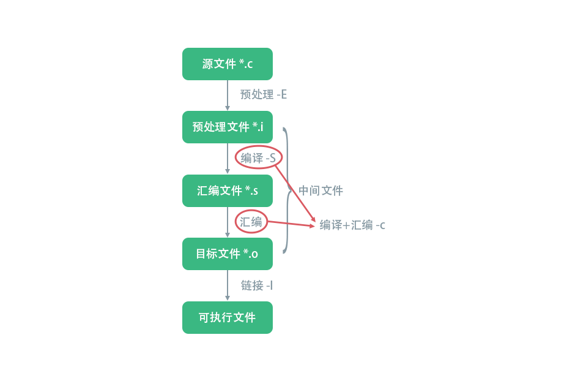

### gcc 的使用
**2019-10-27**

gcc 是最棒的 C 程序编译器（之一）。gcc 编译器会将源代码编译链接成 Linux 可以执行的二进制文件。

```c
$ gcc hello.c
```

如果代码没有错误，会返回到控制台，没有任何提示；如果代码有风险或者错误，则会在控制台中输出。编译链接完成后，将在同一个目录下生成一个输出文件 a.out ，可以使用 `ls` 指令查看文件验证编译链接是否成功。

```bash
$ ls

a.out hello.c
```

#### 如何执行程序

如果不指定名称，gcc 默认输出的可执行文件名为 a.out 。在大多数的 Linux 系统中，都是通过一个名为 PATH 的环境变量来管理系统可执行文件路径的。但通常当前路径（ ./ ）是没有包含在系统 PATH 路径中的，所以需要按照下面的方式执行：

```bash
$ ./a.out

hello world!
```
在执行文件的时候要注意用户在当前目录是否具有执行权限，如果没有执行权限，是不能运行程序的。

#### gcc 编译过程

一般地，编译系统把一份源代码翻译成目标程序的过程会分为5个阶段，分别是 **词法分析**、**语法分析**、**中间代码生成**、**代码优化**、**目标代码生成**。（以下内容摘抄自《 ARM 嵌入式 Linux 系统开发详解》）

1. 词法分析

词法分析的目的是处理源代码中的单词。分析程序时按照从左到右顺序依次扫描源代码，生成单词对应的符号，把字符描述的程序转换成符号描述的中间程序。词法分析程序也被称作此法扫描器，这个过程可以用手工构造，手工构造使用状态图，一般地我们会选择机器构造，机器构造使用的是状态机。

2. 语法分析

语法分析的功能是分许单词符号是否符合语法要求，例如表达式、复制、循环等。此外，语法分析按照语法规则分析检查程序的语句是否符合合理正确的逻辑结构。

语法分析方法有自上而下和自下而上两种方法，自上而下从代码开始的第一个符号开始向下推导，逐步分析；自下而上利用堆栈，把代码按顺序压入栈中，然后再分析是否符合语法。

3. 中间代码生成

中间代码又称作中间语言，是一种介于源代码和目标代码之间的表达方式。使用中间程序既可以完整地表达源代码的含义，又可以使编译程序在逻辑结构上更加简单明确。中间语言是供编译器使用的，常见的表示形式有逆波兰记号、四元式、三元式和树等。

4.代码优化

代码优化的目的是生成有效的目标代码。代码优化通过对中间代码的分析，进行等价变换，达到减小存储空间和缩短运行时间的目的。程序优化并不改变原有的程序功能，只是对代码结构进行调整。代码优化还可以对目标代码进行优化，与中间代码优化相比，对目标代码优化依赖于计算机的类型，一般来说，优化效果更好。

> gcc 可以对代码优化程度进行配置，设置优化级别。使用参数 `-O <优化级别>` 指定。

5. 目标代码生成

编译程序的最后一项任务是生成目标代码。目标代码生成器将中间代码转换成目标代码，通常有3中变换形式：

  * 可以立即执行的机器代码。这种方式对应静态链接方式，程序中所有的地址都重定位，执行效率最高，缺点是占用存储空间最大。

  * 带装配的机器语言模块。这种方式不链接系统共享的库，在需要的时候会由系统加载共享的库文件。

  * 汇编语言代码。该方式经过汇编程序汇编后，直接生成可以在操作系统上运行的目标代码。

源代码经过编译之后，还需要链接才能在 Linux 系统下运行。链接的作用是**把代码中调用的系统函数和对应的系统库建立关系，设置程序启动时候的内存、环境变量等，设置程序退出的状态、释放占用资源等操作**。gcc 在链接用户目标文件时，会根据用户代码使用不用的函数链接对应的动态库或者静态库（默认是动态库），同时还会对所有的目标文件链接固定的预编译的系统目标文件，这几个预编译的目标文件用来完成程序初始化、结束时的环境设置等。

一次完整的 C 程序编译链接过程图示：

<p></p>

#### 探索程序的执行

这里我们用 strace 工具研究程序的执行流程。strace 是 Linux 系统应用程序的调试工具，通常用于监控和调试进程和 Linux 内核之间的交互。Debian 系操作系统可以通过 apt 工具安装 strace ，命令是 `apt-get install strace` 。

我们来研究一下 hello.c 这个程序，这段代码直接输出“ hello world! ”和换行到控制台：

```c
/**
 * hello.c
 */

#include <stdio.h>

int main() {
     printf("hello world!\n");
     return 0;
}

```

执行编译链接指令后，我们得到 a.out 文件，接着输入如下指令：

```bash
$ strace ./a.out
```

输入回车后，打印出程序使用系统调用的结果：

```bash
execve("./a.out", ["./a.out"], 0x7ffff4068ae0 /* 19 vars */) = 0
brk(NULL)                               = 0x7fffc0975000
access("/etc/ld.so.nohwcap", F_OK)      = -1 ENOENT (No such file or directory)
access("/etc/ld.so.preload", R_OK)      = -1 ENOENT (No such file or directory)
openat(AT_FDCWD, "/etc/ld.so.cache", O_RDONLY|O_CLOEXEC) = 3
fstat(3, {st_mode=S_IFREG|0644, st_size=25468, ...}) = 0
mmap(NULL, 25468, PROT_READ, MAP_PRIVATE, 3, 0) = 0x7f1ebc642000
close(3)                                = 0
access("/etc/ld.so.nohwcap", F_OK)      = -1 ENOENT (No such file or directory)
openat(AT_FDCWD, "/lib/x86_64-linux-gnu/libc.so.6", O_RDONLY|O_CLOEXEC) = 3
read(3, "\177ELF\2\1\1\3\0\0\0\0\0\0\0\0\3\0>\0\1\0\0\0\260\34\2\0\0\0\0\0"..., 832) = 832
fstat(3, {st_mode=S_IFREG|0755, st_size=2030544, ...}) = 0
mmap(NULL, 8192, PROT_READ|PROT_WRITE, MAP_PRIVATE|MAP_ANONYMOUS, -1, 0) = 0x7f1ebc640000
mmap(NULL, 4131552, PROT_READ|PROT_EXEC, MAP_PRIVATE|MAP_DENYWRITE, 3, 0) = 0x7f1ebc000000
mprotect(0x7f1ebc1e7000, 2097152, PROT_NONE) = 0
mmap(0x7f1ebc3e7000, 24576, PROT_READ|PROT_WRITE, MAP_PRIVATE|MAP_FIXED|MAP_DENYWRITE, 3, 0x1e7000) = 0x7f1ebc3e7000
mmap(0x7f1ebc3ed000, 15072, PROT_READ|PROT_WRITE, MAP_PRIVATE|MAP_FIXED|MAP_ANONYMOUS, -1, 0) = 0x7f1ebc3ed000
close(3)                                = 0
arch_prctl(ARCH_SET_FS, 0x7f1ebc6414c0) = 0
mprotect(0x7f1ebc3e7000, 16384, PROT_READ) = 0
mprotect(0x7f1ebca00000, 4096, PROT_READ) = 0
mprotect(0x7f1ebc627000, 4096, PROT_READ) = 0
munmap(0x7f1ebc642000, 25468)           = 0
fstat(1, {st_mode=S_IFCHR|0660, st_rdev=makedev(4, 1), ...}) = 0
ioctl(1, TCGETS, {B38400 opost isig icanon echo ...}) = 0
brk(NULL)                               = 0x7fffc0975000
brk(0x7fffc0996000)                     = 0x7fffc0996000
write(1, "hello world!\n", 13hello world!
)          = 13
exit_group(0)                           = ?
+++ exited with 0 +++
```

分析一下关键步骤：

1. line 1 ，使用 `exec*()` 调用可执行文件。exec* 函数是一系列系统调用，包括6种函数：

```c
int execve(const char* path, char* const argv[], char* const envp[]);
int execv(const char* path, char* const argv[]);
int execvp(const char* file, char* const argv[]);
int execle(const char* path, const char* arg, ..., char* const envp[]);
int execl(const char* path, const char* arg, ...);
int execlp(const char* file, const char* arg, ...);
```

看起来比较复杂，但实际上只有 `execve()` 函数是真正的系统调用，其他的函数都是从 `execve()` 函数演化而来的。`execve()` 函数是一个系统调用，作用是执行指定的可执行文件，用可执行文件的内容取代调用 `execve()` 函数进程的内容。简单地讲，新的可执行文件覆盖了当前正在运行的程序，最终的结果就是创建了新的进程。

> `execve()` 函数既可以执行二进制文件，也可以执行合法的 Linux 脚本。

2. line 2 ，使用 `brk()` 函数设置当前进程的数据段。`brk()` 函数很重要，也是一个系统调用，为存放程序内容创建了内存区域。

3. line 7 等，打开共享库文件，并使用 `mmap()` 函数映射共享库文件到内存。

4. line 28 ，调用 `write()` 函数输出字符串到屏幕。`write()` 函数是共享库中的一个函数，也是一个系统调用，源代码中的 `printf()` 函数经过编译之后最终调用的就是 `write()` 函数。

hello world! 程序的执行流程：

<p></p>

#### 库的使用

Linux 系统中有两种程序库，分别是**静态库（static library）**和**动态库（shared library）**。

静态库是在程序链接的时候，把库函数的目标代码和程序链接在一起。而使用更加广泛的是动态库，从字面上来看，翻译成“共享库”可能更加恰当，但从功能上来看，“动态库”更能体现这类库文件的特点。动态库的工作原理是，相同功能的代码可以被多个程序共用，在程序加载的时候，内核会检查程序使用的动态库是否已经加载到内存，如果还未加载，贼从系统库路径搜索并加载相应的动态库；如果动态库已经加载到内存，那么程序可以直接使用而无需加载。

从动态库的执行方式来看，动态库是仅会被系统加载一次的，这样意味着对应的应用程序会更小。拿 hello.c 这个程序对静态库和动态库的使用做一个对比。

首先使用静态方式编译：

```bash
gcc -static hello.c
```

查看 a.out 的文件大小：

```bash
$ ls -l -h a.out
-rwxrwxrwx 1 yangholmes yangholmes 825K Oct 31 10:55 a.out
```

接下来看看动态链接方式，这也是 gcc 的默认链接方式：

```bash
gcc hello.c
```

查看 a.out 的文件大小：

```bash
$ ls -l -h a.out
-rwxrwxrwx 1 yangholmes yangholmes 8.2K Oct 31 10:57 a.out
```

可以看到，动态链接和静态链接得到的文件大小相差了100倍！

#### 编译动态库文件

gcc 可以把源文件编译成动态库文件，我们可以把项目里使用频繁的代码汇集成动态库文件，以供其他源码调用。使用 gcc 的 `-shared` 选项，编译动态库文件的命令为：

```bash
$ gcc test.c -fPIC -c -o test.o
$ gcc test.o -shared -o libtest.so
```

或者一步到位：

```bash
$ gcc test.c -fPIC -shared -o libtest.so
```

其中，参数 `-fPIC` 作用于编译阶段，告诉编译器产生与位置无关代码（Position-Independent Code）。位置独立的代码即位置无关代码，在可执行程序加载的时候可以存放在内存内的任何位置。若不使用该选项则编译后的代码是位置相关的代码，在可执行程序加载时是通过代码拷贝的方式来满足不同的进程的需要，没有实现真正意义上的位置共享。这样一来，产生的代码中就没有绝对地址了，全部使用相对地址，所以代码可以被加载器加载到内存的任意位置，都可以正确的执行。这正是共享库所要求的，共享库被加载时，在内存的位置不是固定的。

#### 尾声

这一篇学习 gcc 的笔记完结了。事实上，gcc 和 C 程序还有许多有趣的宝藏尚未发掘，这里只学了一点点皮毛，就像冰山上的一片雪花，更多的知识和笔记，继续学继续写吧。
