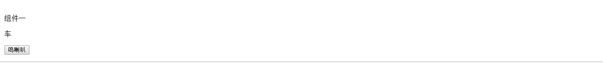
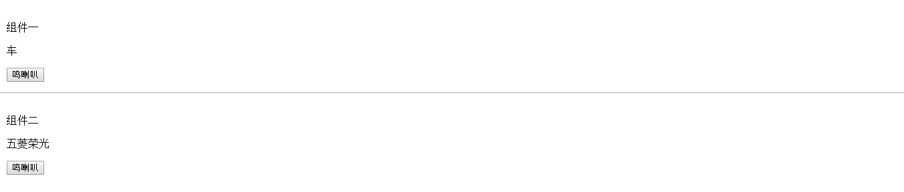
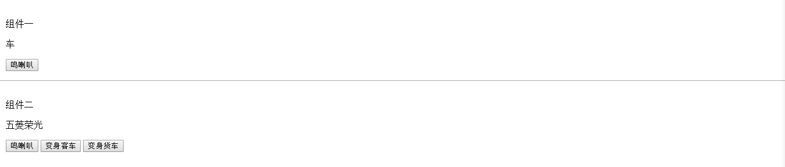

### “面向对象”的组件开发
**2018-05-17**

适用范围：`Vue.js`

这里介绍一种组件扩展的方法，为什么要用引号标记“面向对象”呢？因为这中扩展方法有点像“继承”，但是又完全不一样，准确地说，只是一种组件的“混合”或者“扩展”。

#### 情景设定
假设我们有个项目，为各种不同的汽车建模，达到展示汽车各种性能特色的目的。

#### 设计
按照面向对象思维设计，首先应该抽象出不同汽车的共同点，创建一个叫做`Car`的“父类”组件，其他汽车只需要“继承”`Car`组件，对自身进行个性化的配置。

我们简单设计一个`Car`的组件，所有汽车都是车，我们为`Car`定义一个车型的属性叫做“车”。接下来，所有汽车都可以鸣喇叭，所以我们要为车定义一个方法叫做“鸣喇叭”。不同的车喇叭声音应该不一样，但是鸣喇叭的方式都是一样的：蜂鸣器，所以我们将“鸣喇叭”这个动作命名为“Buzzer”。我们为“Buzzer”编写一个`onBuzzer`的方法模拟喇叭响，将我们的车型打印出来。

```html
    <!-- Car.vue -->
    <template lang="html">
        <div class="car">
            <p>{{model}}</p>
            <button @click="onBuzzer">鸣喇叭</button>
        </div>
    </template>

    <script>
    export default {
        data() {
            return {
                model: '车'
            };
        },
        methods: {
            onBuzzer() {
                alert('我是' + this.model);
            }
        }
    };
    </script>
```



接下来我们来当一回车厂，生产一辆常见的汽车。选取一辆比较有特色的车子，比如五菱荣光。新建一个组件，命名为`Rongguang`。首先五菱荣光是汽车的一种，所以它应该继承了父类`Car`组件的优良传统（拥有型号、可以鸣喇叭），拥有自己的型号“五菱荣光”。然后五菱荣光是一款非常有特色的车子，它可以客货两用，因此我们为`Rongguang`定制一个专属的方法，用于切换车子客车和货车的状态。

那么问题来了，在Vue的组件设计中，如何实现这种“继承”呢？查阅`Vue.js`的API文档，我们发现了组件具有[extends](https://cn.vuejs.org/v2/api/#extends)的接口，参数是一个包含组件选项的对象。我们试着使用`extends`对`Car`进行扩展。

```html
    <!-- Rongguang.vue -->
    <template lang="html">
        <div class="rongguang">
            <p>{{model}}</p>
            <button @click="onBuzzer">鸣喇叭</button>
        </div>
    </template>

    <script>
    import Car from './Car';
    export default {
        extends: Car,
        data() {
            return {
                model: '五菱荣光'
            };
        },
        methods: {}
    };
```

看看效果



这样就实现了“继承”。

#### 原理
通过`extends`接口实现了组件的“继承”，我们来看一看原理是什么。
> extends
>
> * 类型：Object | Function
>
> * 详细：
>
>   允许声明扩展另一个组件(可以是一个简单的选项对象或构造函数)，而无需使用 Vue.extend。这主要是为了便于扩展单文件组件。
>
>   这和 mixins 类似。

其实就是通过`extends`扩展了组件，将“父类”的组件“继承”到“子类”中，包括`beforeCreate`、`beforeDestory`、`data`、`methods`、`render`内容。也就是说，“子类”组件“继承”之后，什么都不用做就具有了“父类”组件的`create`和`destory`钩子，数据`data`，和方法`methods`。如果“子类”组件中出现“父类”同名的属性，那么这个属性将会被“子类”的属性覆盖变成新值，但不会影响“父类”组件同名的属性。“继承”来的方法也是一样，方法名相同的时候“子类”方法将会被改写，但不会影响“父类”。

#### 进一步
我们进一步对五菱荣光定制，为其增加状态切换方法，实现客车和货车的切换。

```html
    <!-- Rongguang.vue -->
    <template lang="html">
        <div class="rongguang">
            <p>{{model}}</p>
            <button @click="onBuzzer">鸣喇叭</button>
            <button @click="onTranslate(0)">变身客车</button>
            <button @click="onTranslate(1)">变身货车</button>
        </div>
    </template>

    <script>
    import Car from './Car';
    export default {
        extends: Car,
        data() {
            return {
                model: '五菱荣光',
                types: ['客车', '货车']
            };
        },
        methods: {
            onTranslate(type) {
                alert('我是' + this.types[type]);
            }
        }
    };
    </script>
```



这样就实现了定制。
