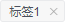
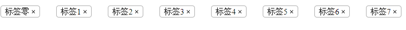

### 如何设计一个易用的tag组件
**2018-05-15**

前一阵子，项目上有一个tag功能需求，要求实现标签的显示、修改和样式定制。我们的项目已经引入了[iView](https://www.iviewui.com/)作为UI组件，立即就想到直接使用iView的tag组件。

但是问题来了，iView的tag组件只支持内容显示和样式定制，不支持内容编辑，考虑了一下，去修改iView的内容显得不经济，特别是团队合作的时候，第三方的`node_modules`还是不去做更改比较好。

换个角度考虑，tag其实一种功能特别简单的前端元素，在处处组件化设计的今天，只需要设计出一个API良好的tag组件，便可在项目中随处使用，团队分享也就是顺理成章的事情了。

#### 设计
设计组件，接口是最重要的。因为组件作为一个黑盒，使用的时候，用户不是特别关心组件的实现细节，他只关心组件怎么用，能收到什么效果。所以首先关心需求：
1. 标签内容可显示
2. 标签内容可编辑
3. 标签外观可以自定义

然后根据需求设计API

| attribute | type | description |
| - | :-: | :-: |
| value | `string` &#124;&#124; `number` | 标签内容，双向绑定时使用`v-model` |
| v-model | `string` | Vue.js指令，用于数据双向绑定 |
| editable | `boolean` | 是否可编辑，默认`false`，不可编辑 |
| closable | `boolean` | 是否可关闭，默认`false`，不可关闭 |
| bgColor | `string` | 背景颜色，默认`#fff` |
| border | `string` | 边框样式，默认`dashed` |

#### UI与交互
由于项目中已经使用了iView组件，为了保持一致，我决定把tag设计成iView风格。

纯展示用的标签其实没有什么交互可言，我们现在要设计的tag需要提供编辑功能，那么还是需要对标签编辑提供一套良好的交互。

编辑的状态变换：

    展示状态 -> 编辑状态 -> 编辑完成 -> 展示状态

除了编辑，tag还应该提供删除功能。综上所述，最简单直接的方法就是在tag中添加一个编辑按钮和删除按钮，就像这样


交互看起来很直接，但是外观比较丑。。。另外这样的设计需要准备“编辑”和“删除”图标，无论是使用图片还是字体图标，都需要引入额外的资源。为了更小巧灵活，我决定不使用额外的图标，删除按钮使用css去绘制，编辑状态变换直接用双击tag标签触发。最终的tag应该会是这样的



后面的工作就是实现它。

#### 编写代码
原生HTML，不管是HTML5还是之前的版本，都没有类似`<tag>`这样的标签，所以我们可以大胆地将我们自定义的标签组件命名为`<tag>`。为了标识出是一个非浏览器原生的标签，通常可以将首字母大写，就成了`<Tag>`。HTML本身是不区分大小写的，也就是说`<tag>`和`<Tag>`没有区别，但是vue组件可以区分，编译之后其实是vue template里面的内容。然而，iView标签命名也叫做`<Tag>`，这就意味着我们不能使用`<Tag>`这个标签了。既然我们比iView功能更强大一点，那我们干脆就叫做`<ExTag>`，含义是“扩展型标签”。命名遵循驼峰，首字母大写表示这是一个自定义组件而不是HTML原生标签。

API声明。API是父组件传递给子组件用于定制外观、初始化状态或者数值传递的接口。在vue组件中是用`props`去实现的。`props`实现了由父到子的单向数据流，数据逆向的传递需要利用事件触发去实现，这样的机制会导致自定义组件在使用的时候需要注册额外的事件回调。还好Vue.js为我们提供了数据双向绑定的语法糖[`v-model`](https://cn.vuejs.org/v2/guide/components-custom-events.html#%E8%87%AA%E5%AE%9A%E4%B9%89%E7%BB%84%E4%BB%B6%E7%9A%84-v-model)。最终的API设计

```js
    props: {
        value: String || Number,
        editable: {
            type: Boolean,
            default: false
        },
        closable: {
            type: Boolean,
            default: false
        },
        bgColor: {
            type: String,
            default: '#fff'
        },
        border: {
            type: String,
            default: 'dashed'
        }
    }
```

定义`v-model`的props接口和事件

```js
    model: {
        prop: 'value',
        event: 'modified'
    }
```

`<ExTag>`的UI分成两层，一层是标签显示，第二层是标签编辑。显示层还肩负起鼠标双击事件监听的重任。

```html
    <div class="ex-tag" :style="`background-color: ${bgColor}; border-style: ${border}`">
        <span class="tag"
            v-show="!editing"
            @dblclick="onEditTag">{{value}}</span>
        <span class="tag-shadow" ref="exTagShadow">{{value}}</span>
        <input class="tag-editor" type="text"
            ref="exTagEditor"
            v-show="editing"
            :style="`width: ${tagWidth}`"
            :value="value"
            @input="onTagChange($event)"
            @focus="onTagFocus($event)"
            @blur="onTagBlur($event)"
            @keydown="onTagKeydown($event)">
        <span class="kill-myself"
            v-show="closable"
            @click="onSuicide"></span>
    </div>
```

`tag-shadow`这一层是用于计算整个tag标签长度，不需要显示出来，将用css隐藏这一层。

```less
    .tag-shadow {
        display: inline-block;
        position: absolute;
        top: -100%;
        right: -100%;
        z-index: -999;
    }
```

`kill-myself`用于装载删除按钮，删除图标用css绘制，利用伪元素`::before`和`::after`绘制出两条相互90°交叉的直线。

```less
    .kill-myself {
        &::before,
        &::after {
            content: '';
            position: absolute;
            top: calc( .5em - .05em );
            left: 0;
            background: #000;
            display: inline-block;
            width: 1em;
            height: .1em;
        }
        &::before {
            transform: rotate(45deg);
        }
        &::after {
            transform: rotate(-45deg);
        }
        &:hover,
        &:active {
            &::before,
            &::after {
                background: #777;
            }
        }
    }
```

双击标签触发编辑，将事件绑定在第一层显示层上，用变量`editing`控制，进入编辑状态后，光标应该自动聚焦到`<input>`上

```js
    onEditTag() {
        if (!this.editable) {
            return false;
        }
        this.editing = true;
        this.$nextTick(() => {
            this.$refs.exTagEditor.focus({preventScroll: false});
        });
    }
```

编辑完成的标志是，用户按下回车或者用户将光标移出`<input>`，这里要对`<input>`注册两个事件回调

```js
    onTagBlur(event) {
        this.editing && this.modifyVal(event);
        this.$emit('blur', [event, this.value]);
    },
    onTagKeydown(event) {
        if (event.keyCode === 13) {
            this.modifyVal(event);
        }
        this.$emit('keydown', [event, this.value]);
    }
```

`modifyVal`方法用于检查用户输入和`v-model`事件触发

```js
    modifyVal(e) {
        let value = e.target && e.target.value;
        value = value.trim();
        this.$emit('modified', value);
        this.editing = false;
    }
```

删除标签的事情应该交给父组件去决定，子组件负责将删除事件通知发送给父组件

```js
    onSuicide() {
        this.$emit('suicide', this.value);
    }
```

基本上就完成了。

#### 拉出来遛一遛



#### 不足之处
API设计有一个失误，就是背景颜色接口的命名没有遵循html的命名规则，错误使用了驼峰命名。

#### Github
完整代码和示例请看[github](https://github.com/Yangholmes/yang-components/tree/master/src/components/ex-tag)
