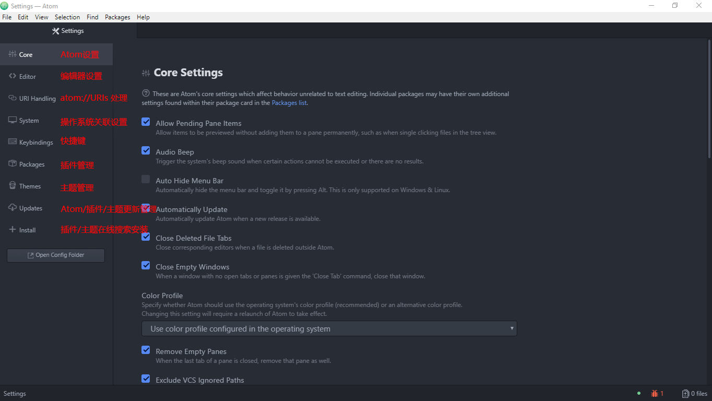
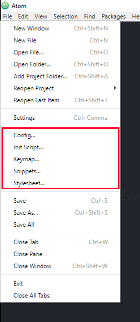
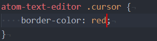
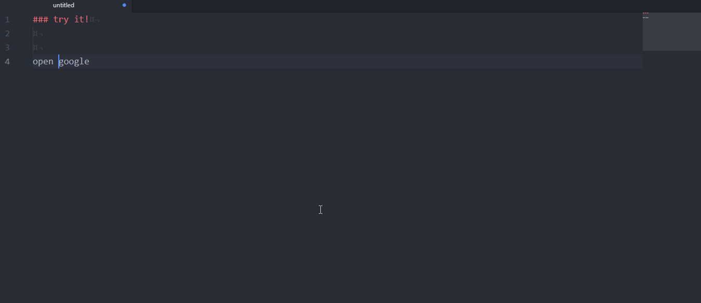
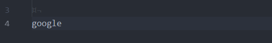
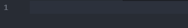
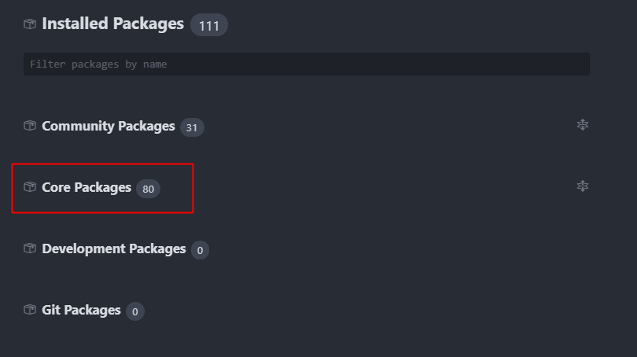
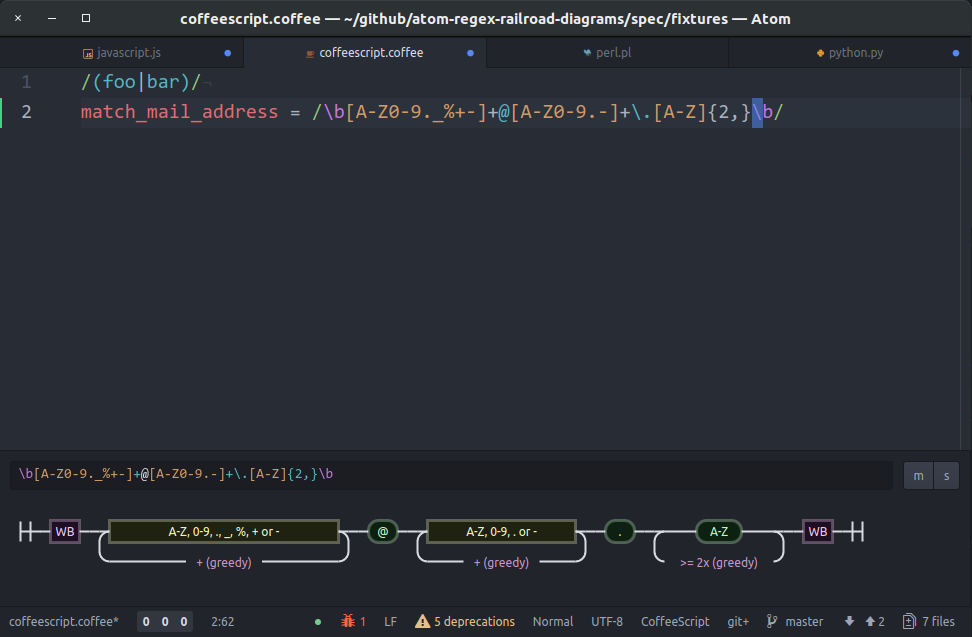
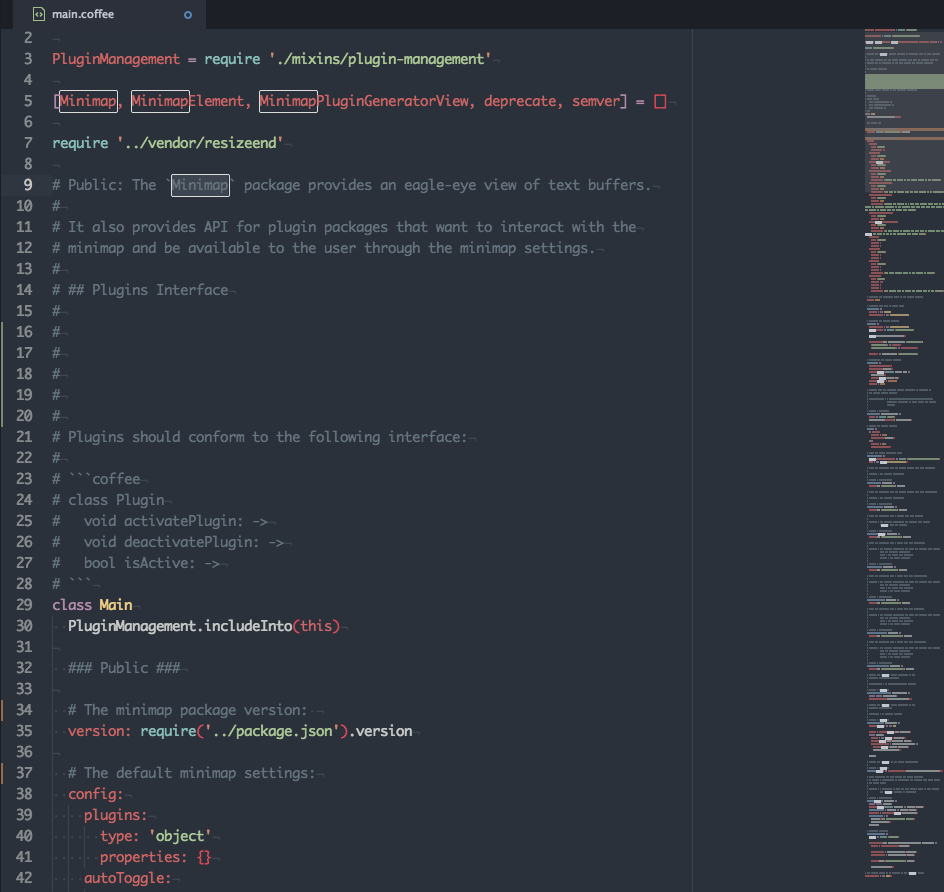

### Atom 改装指南
**2018-06-22**


`忽闻微软收GitHub，感觉Atom要凉凉`

#### 前言
优秀的编辑器就像优秀的车一样，载着家人的时候舒适安全，开去越野的时候动力强劲。爱驾驶的人喜欢购买基本款，然后按照自己的习惯和喜好改装，获得独一无二最适合自己的车子。和这些人一样，程序员也喜欢使用能够自己改装的编辑器，打造出最适合自己的IDE。

所有的基本款里面，我最喜欢的就是Atom了。

我是从2015年末开始使用Atom，第一次打开的时候就被惊艳到了——默认主题足够Geek，等宽的consolas字体，不刺眼的配色。这些已经足够打动我。当时只是想找一个Sublime Text 3 的替补编辑器，没想到试用Atom之后，替补成功成为首发，Sublime退居二线。

详细地说来，Atom优点在于：

1. 开箱即用，几乎不需要学习；
2. 开源免费；
3. 社区活跃，插件丰富；
4. 插件既可以使用`apt`指令安装，也可以使用内置可视化插件中心搜索安装（这个点真的是太友好了）；
5. Electron项目，跨平台（万一以后有钱了买个MacBook也能用😊）；
6. 主题丰富，和插件一样，主题的配置安装也是可视化的；
7. ……

由于Atom的可拓展性实在太高，所以利用插件可以将普通编辑器打造成一个强大的IDE。

#### Atom设置
初安装好的Atom不一定满足自己的使用习惯，可以通过设置来自定义。

##### 懒人向
Atom的配置可以很“懒惰”。


打开设置面板，`File->Settings`，熟手之后也可以直接使用快捷方式 `Ctrl + ,`



各个面板的功能总览：

* Atom设置：诸如编辑器文字编码、系统警告一类的设置
* 编辑器设置：即文字编辑区域的设置，可以进行字体类型、字体大小、缩进、特殊字符可视化等配置
* URI处理：配置如何处理`atom://URIs`资源标识符
* 系统设置：与操作系统相关的设置，例如要不要注册到系统资源管理器上下文菜单等
* 快捷键：配置/查看快捷键，注意，Atom的插件非常多，每一个插件都有可能有一套自己的快捷键，所以经常会出现快捷键冲突，可以利用这个面板查看冲突的快捷键
* 插件：设置/停用/启用/删除 已经安装好的Atom插件
* 主题：设置/停用/启用/删除 已经安装好的Atom主题
* 更新：用于查看 Atom/插件/主题 版本更新
* 安装：用于 插件/主题 在线搜索安装

##### 非懒人向

非懒人向的设置时通过修改Atom的配置文件来自定义外观，相比起懒人向，非懒人向可配置的内容更加丰富，配置项检索更加方便。



Atom配置入口在这里

由于Atom是Electron项目，所以整个编辑器其实是一个Web，里面每一个模块都是DOM，所以可以和操作网页一样操作这个编辑器。

* config：[~/.atom/config.cson] 主配置文件，修改这个文件会同步到交互式设置页面，反过来，交互式页面中修改了设置，主配置文件相应的键值也会改变
* init script：[~/.atom/init.coffee] Atom启动脚本
* Keymap：[~/.atom/keymap.cson] 定义快建建，会同步到交互式的快捷键设置页面
* snippets：[~/.atom/snippets.cson] 自定义代码补全规则
* stylesheet：[~/.atom/styles.less] 定义编辑器外观

早期的Atom使用`coffee`编写，尽管后面改用了原生`JavaScript`，但是这个编辑器还是保留了一些`coffee`的痕迹，例如Atom的初始化启动脚本还是要使用`coffee`编写。

###### 举栗子

1. styles.less

    styles.less用来定义编辑器外观,实际上就是一个普通的less文件,Atom将这份less编译成css然后用于样式渲染。

    ```less
    // 将编辑器内的光标设置成红色
    atom-text-editor .cursor {
        border-color: red;
    }
    ```

    效果:

    

2. init.coffee

    一个著名的示例，调用Atom的Selection API和Clipboard API，添加一个`Markdown`快速粘贴超链接命令。

    ```coffee
    atom.commands.add 'atom-text-editor', 'markdown:paste-as-link', ->
    return unless editor = atom.workspace.getActiveTextEditor()

    selection = editor.getLastSelection()
    clipboardText = atom.clipboard.read()

    selection.insertText("[#{selection.getText()}](#{clipboardText})")
    ```

    效果：

    

3. keymap.cson

    我们已经在`init.coffee`中注册好了一个`markdown:paste-as-link`指令，现在试着将这个指令映射到一组快捷键`ctrl-alt-shift-m`上。

    ```cson
    'atom-workspace':
    'ctrl-alt-shift-m': 'markdown:paste-as-link'
    ```

    效果：

    

4. snippets.cson

    `snippets.cson`可以用来定义一些常用的代码片段，例如我们常在`JavaScript`中使用`console.debug`调试log，但觉得`console`语句太长了，希望可以输入关键字自动补全。

    ```cson
    '.source.js':
        'console debug':
            'prefix': 'debug'
            'body': 'console.debug($1)'
    ```

    效果：

    

#### 插件

Atom其实很简单，就是一个Chromium框架，甚至连搜索/替换的功能都没有，更不用说什么代码着色、代码补全这些稍微高级一点的功能了。

作为一款现代编辑器，如果面面俱到包含所有功能的话，那么软件可能会做得体积特别大，加载运行特别慢。况且，任何一款软件都不可能做到面面俱到，符合每一个人的口味，特别是程序员，操不同语言的程序员需要的工具不同，就算是操相同语言的程序员，他们所偏好的东西也大相径庭。

所以Atom采用了`Package`的方式来满足不同的需求，任何功能都可以用“包”（或者我们称它为“插件”）的方式来安装，比如Atom的文件列表就是通过一个叫`tree-view`的插件实现的。Atom默认安装了80个核心插件用于满足基本需要（版本是1.28.0），除了文件树、标签等编辑器框架，还包含了33种流行的计算机语言着色插件和Git，其实已经有所冗余。



其他个性化的插件可以在Atom的社区中下载安装，访问[https://atom.io/packages](https://atom.io/packages)，输入关键字搜索出到众多第三方插件，点击进入可以查看每一个插件的介绍、GitHub地址、版本更迭、bugs列表和授权方式。Atom内置了一个类似`npm`的命令行工具`apm`，在社区中找到自己心仪的插件之后，只需要运行`apm install [package]`即可将插件安装到Atom中去。当然Atom也提供了更快的安装方式，在设置中心Install板块中搜索社区提供的插件，得到结果后，只需要动动手指点击“安装”按钮就可以将插件下载安装到本地了。

第三方插件允许自由安装、配置、删除、启用、停用，而核心插件不允许删除，只允许配置、停用和启用。

##### 插件推荐

由于插件的获取太简单了，所以诸如语言支持这一类的插件就不赘述，这里推荐几款我觉着对前端特别实用的插件。

1. [regex-railroad-diagram](https://atom.io/packages/regex-railroad-diagram)

    实时正则表达式图表，光标到达之处如果存在正则表达式，则会在表机器下方渲染出正则表达式匹配路线图。

    

2. [color-picker](https://atom.io/packages/color-picker)

    颜色选择器，样式编写必备。支持`HEX`，`HEXa`，`RGB`，`RGBa`，`HSL`，`HSLa`，`HSV`，`HSVa`，`VEC3`和`VEC4`格式，支持`sass`和`less`颜色变量。

    

3. [minimap](https://atom.io/packages/minimap)

    代码块预览，类似Sublime Text 3 `minimap`的功能。

    

#### 缺点和隐患