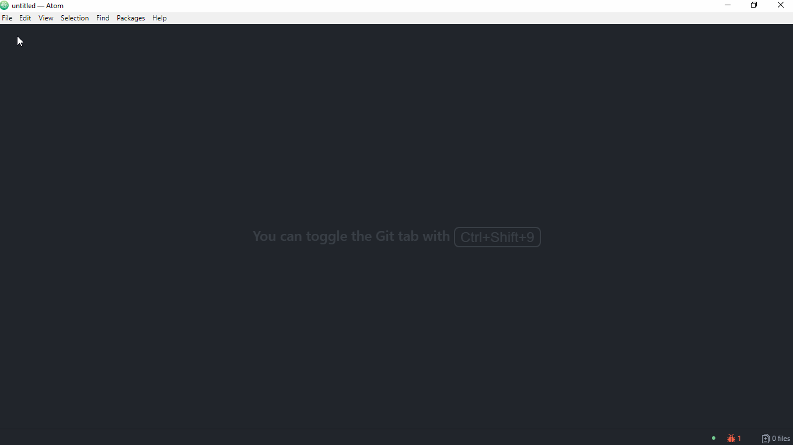

### Atom 改装指南
**2018-06-22**

`忽闻微软收GitHub，感觉Atom要凉凉`

#### 前言
优秀的编辑器就像优秀的车一样，载着家人的时候舒适安全，开去越野的时候动力强劲。爱驾驶的人喜欢购买基本款，然后按照自己的习惯和喜好改装，获得独一无二最适合自己的车子。和这些人一样，程序员也喜欢使用能够自己改装的编辑器，打造出最适合自己的IDE。

所有的基本款里面，我最喜欢的就是Atom了。

我是从2015年末开始使用Atom，第一次打开的时候就被惊艳到了——默认主题足够Geek，等宽的consolas字体，不刺眼的配色。这些已经足够打动我。当时只是想找一个Sublime Text 3 的替补编辑器，没想到试用Atom之后，替补成功成为首发，Sublime退居二线。

详细地说来，Atom优点在于：

1. 开箱即用，几乎不需要学习；
2. 开源免费；
3. 社区活跃，插件丰富；
4. 插件既可以使用`apt`指令安装，也可以使用内置可视化插件中心搜索安装（这个点真的是太友好了）；
5. Electron项目，跨平台（万一以后有钱了买个MacBook也能用😊）；
6. 主题丰富，和插件一样，主题的配置安装也是可视化的；
7. ……

由于Atom的可拓展性实在太高，所以利用插件可以将普通编辑器打造成一个强大的IDE。

#### Atom改装
初安装好的Atom只不过是一个稍微好看点的编辑器，只有通过改装才能变得强大。

##### 懒人向
Atom的配置可以很“懒惰”。

打开设置面板（File->Settings）

